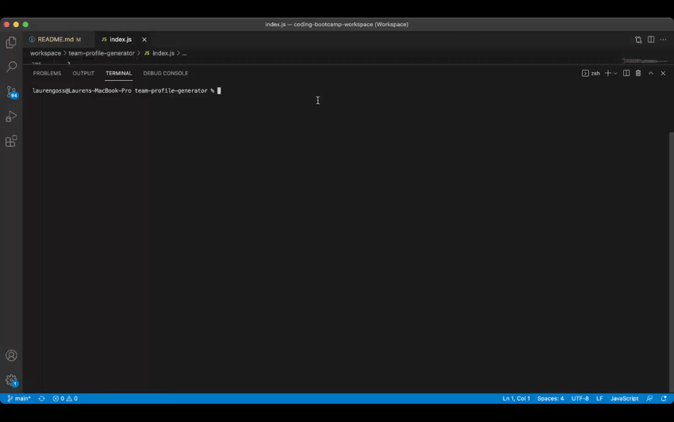
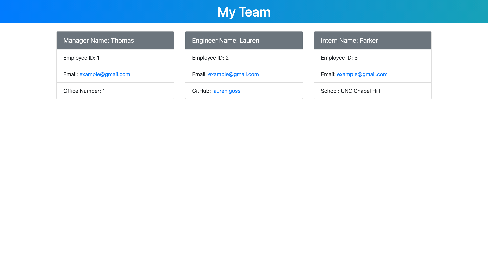

# team-profile-generator

## Description

JavaScript application that prompts the user to input team information into the terminal and outputs an index.html file with their team's information.

## Table of Contents

* [Installation](#Installation)
* [Usage](#Usage)
* [Tests](#Tests)
* [Questions](#Questions)

## Installation

Required packages:
  * Node
  * Inquirer JS

## Usage

To invoke the application run this command in the terminal:

```bash
node index.js
```

The user will then be presented with a series of questions within the terminal regarding their team. The first question will prompt the user to input information about the manager including name, employee ID, email address, and office number. After the user is done inputting information about the manager and after each subsequent team member added, the application will then ask if the user would like to add an additional member (engineer or intern), or if they are done creating their team.

If the user chooses to add an engineer, they will be prompted to input information about that team member including name, employee ID, email address, and GitHub username.

If the user chooses to add an intern, they will be prompted to input information about that team member including name, employee ID, email address, and school.

The user can add as many team members as they wish until they choose to end the inquirer session. The application will take the user's input and insert their answers into an automatically generated index.html file. This new file will be placed within the /dist folder.

## Tests

### Team Building Walkthrough


### Testing Suites

Application passes all 4 testing suites.



### Example HTML



## Questions

Do you have questions? Contact me here:

* [GitHub](https://github.com/laurenlgoss)
* [Email](laurenlgoss98@gmail.com)